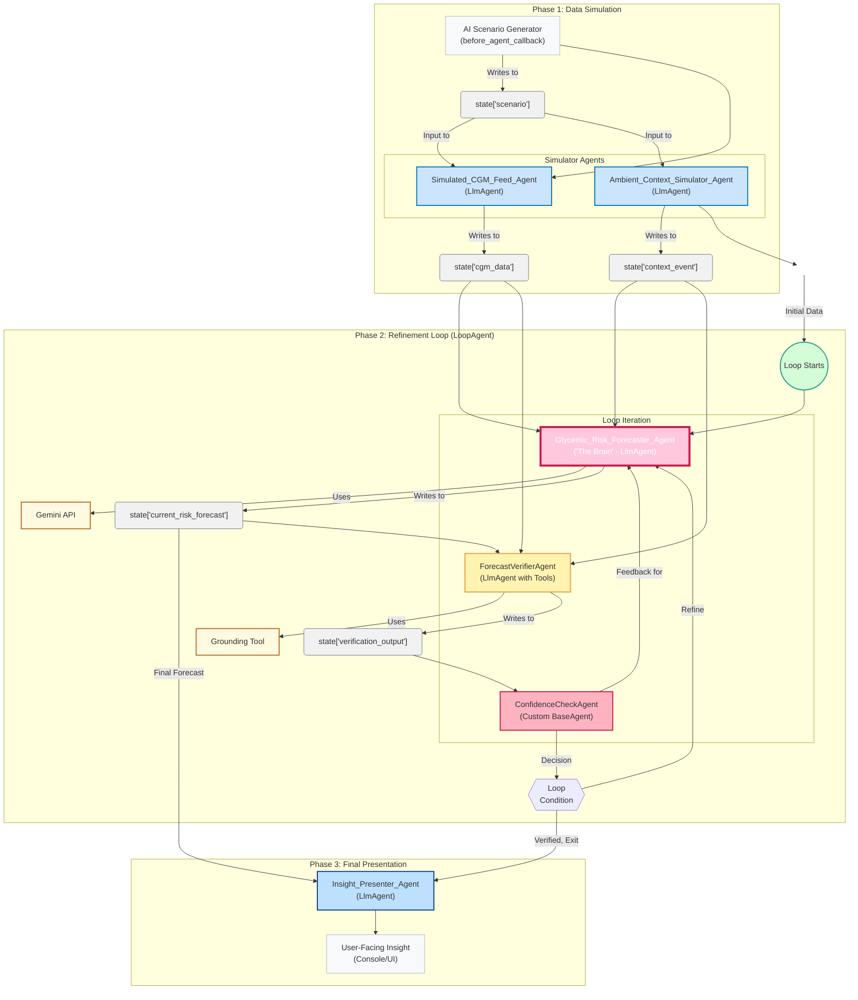

# Glycemic Sentinel
## A Proactive Multi-Agent AI Swarm for T1D Insight Generation

> Our multi-agent AI for T1D analyzes your live health data to see what's coming next, giving you proactive insights to prevent problems before they start.

[](https://www.python.org/downloads/)
[](https://fastapi.tiangolo.com)
[](https://cloud.google.com/agent-development-kit)

---

## 🎯 The Problem: From Reactive Alarms to Proactive Awareness

Managing Type 1 Diabetes is a relentless, 24/7 job of high-stakes decision-making. Most digital health tools are **reactive**—they sound an alarm when glucose is already too high or too low, leaving the user to deal with a problem that has already occurred. This approach leaves the cognitive burden entirely on the individual and can lead to moments of crisis and indignity.

This project was inspired by witnessing such a moment firsthand. It's built on a single premise: **care should be predictable and proactive, not reactive**. What if an intelligent system could provide a quiet warning an hour before a problem arises, empowering individuals with the foresight to act, not just react?

## 🚀 Our Solution: Glycemic Sentinel

Glycemic Sentinel is a prototype of a proactive AI co-pilot designed to change that paradigm. It is not a single AI; it's a sophisticated **swarm of eight specialized agents**, orchestrated using Google's Agent Development Kit (ADK), that work in concert to provide predictive, "heads-up" style micro-insights.

The system analyzes a continuous stream of simulated health data—glucose, meals, exercise, even complex contexts like stress or illness—to identify potential risks before they become critical events.

### ✨ Key Features & "Wow Factor"

- **🎭 Advanced Multi-Agent Orchestration**: The system uses a nested architecture of `SequentialAgent` and `LoopAgent` to manage a complex, multi-stage workflow, showcasing a deep and practical application of ADK.

- **🧠 Proactive Insight Generation with Gemini**: At its core, a "Brain" agent leverages Google's Gemini to perform nuanced analysis of correlated health data, generating sophisticated risk forecasts.

- **🔄 Self-Refining Verification Loop**: The true innovation lies in our feedback loop. A dedicated `ForecastVerifierAgent` critically assesses the "Brain's" forecast for accuracy and plausibility, using grounding tools to inform its critique. If confidence is low, the system loops, forcing the "Brain" to reconsider and refine its own insight based on the feedback.

- **🎲 Dynamic Scenario Simulation**: The entire workflow is fed by an AI-powered scenario generator that creates dynamic and realistic T1D situations, including edge cases and contradictory data, to thoroughly test the swarm's intelligence.

## 🏗️ Technical Architecture

Our architecture is designed in three distinct phases, managed by a top-level `T1dInsightOrchestratorAgent`.

### Architecture Diagram



### 🤖 Agent Roles

| Agent | Type | Role |
|-------|------|------|
| **AI Scenario Generator** | `before_agent_callback` | An AI function that dynamically generates a single, unified scenario description to seed the simulation |
| **T1dInsightOrchestratorAgent** | `SequentialAgent` | The master conductor that manages the entire three-phase workflow |
| **SimulatedCGMFeedAgent** | `LlmAgent` | Interprets the unified scenario to generate realistic mock CGM data |
| **AmbientContextSimulatorAgent** | `LlmAgent` | Interprets the unified scenario to generate realistic mock contextual event data |
| **LoopRefinementAgent** | `LoopAgent` | Encapsulates and manages the iterative verification and refinement process |
| **GlycemicRiskForecasterAgent** | `LlmAgent` | The core analytical agent that generates the initial (and refined) risk forecast |
| **ForecastVerifierAgent** | `LlmAgent with Tools` | Critically assesses the Brain's forecast against the original data and grounded knowledge |
| **ConfidenceCheckAgent** | `Custom BaseAgent` | A custom-built agent that parses the verifier's output and determines if the loop should continue or exit |
| **InsightPresenterAgent** | `LlmAgent` | Takes the final, verified forecast and presents it to the user in a clear, empathetic manner |

## 🛠️ Key Technologies

- **Primary Language**: Python 3.12+
- **AI Framework**: Google Agent Development Kit (ADK)
- **LLM**: Google Gemini API
- **API/Web Interface**: FastAPI, Uvicorn
- **Data Validation**: Pydantic
- **Environment Management**: Conda
- **Real-time Updates**: Server-Sent Events (SSE)
- **Progress Tracking**: Custom session-based system

## 📋 Prerequisites

Before setting up Glycemic Sentinel, ensure you have:

- **Python 3.12+** installed
- **Conda** (or Miniconda) installed and configured
- **Google Cloud Project** with Vertex AI API enabled
- **gcloud CLI** installed and authenticated
- **Git** for cloning the repository

## 🚀 Installation & Setup

### 1. Clone the Repository

```bash
git clone <your-repo-url>
cd T1d-swarm
```

### 2. Create Conda Environment

Create the conda environment from the provided configuration:

```bash
conda env update -f environment.yml
```
or 

### 2.1 Use Virtual environment

```bash
# Create virtual environment
python -m venv .venv

# Activate virtual environment
# On Windows:
.venv\Scripts\activate

# On macOS/Linux:
source .venv/bin/activate

# Install requirements
pip install -r requirements.txt
```

### 3. Google Cloud Authentication

Ensure your environment is authenticated to use the Vertex AI API:

```bash
# Authenticate with Google Cloud
gcloud auth application-default login

# Set your project ID (replace with your actual project ID)
gcloud config set project YOUR_PROJECT_ID
```

### 4. Environment Variables

Create a `.env` file in the root directory:

```bash
# .env file
GOOGLE_CLOUD_PROJECT=your-project-id
JUDGE_CODES=code1,code2,code3  # Optional: for access control
PORT=8080  # Optional: defaults to 8080
```

### 5. Verify Installation

Test that everything is working:

```bash
python -c "import google.adk; print('ADK imported successfully')"
```

## 🎮 Running the Project

### Option 1: Web API Server (Recommended)

Start the FastAPI server for full functionality including web interface:

```bash
python main.py
```

Or alternatively:

```bash
uvicorn main:app --reload --host 0.0.0.0 --port 8080
```

The server will start at `http://localhost:8080`

#### Available Endpoints:

- **API Documentation**: `http://localhost:8080/docs` (Swagger UI)
- **Progress Tracking**: `http://localhost:8080/progress/{session_id}` (SSE)
- **Scenario Management**: `http://localhost:8080/scenarios`
- **Agent Execution**: Via Google ADK endpoints


## 📡 API Usage

### Starting a New Session

1. **Get Available Scenarios**:
   ```bash
   curl http://localhost:8080/scenarios
   ```

2. **Set a Scenario**:
   ```bash
   curl -X POST http://localhost:8080/get-scenario/ \
     -H "Content-Type: application/json" \
     -d '{
       "scenario_id": "post_meal_spike",
       "session_id": "your-session-id",
       "custom_text": ""
     }'
   ```

3. **Monitor Progress** (SSE):
   ```javascript
   const eventSource = new EventSource('/progress/your-session-id');
   eventSource.onmessage = function(event) {
     console.log('Progress:', JSON.parse(event.data));
   };
   ```

### Available Scenarios

The system includes several predefined scenarios:

- `🍕 post_meal_spike` - Post-meal glucose management
- `🏃 exercise_session` - Exercise-induced glucose changes  
- `😰 stress_response` - Stress-related glucose fluctuations
- `🤒 illness_management` - Managing glucose during illness
- `🌙 overnight_trends` - Nocturnal glucose patterns
- `🎲 random` - AI-generated random scenario
- `✍️ custom` - Custom scenario input

## 🔧 Configuration

### Environment Variables

| Variable | Description | Default |
|----------|-------------|---------|
| `GOOGLE_CLOUD_PROJECT` | Your Google Cloud project ID | Required |
| `JUDGE_CODES` | Comma-separated access codes | Optional |
| `PORT` | Server port | `8080` |

### Session Management

The system uses session-based state management:
- Each session gets a unique ID
- Sessions are isolated from each other
- Progress tracking is per-session
- Sessions persist for the duration of the agent execution

## 🐛 Troubleshooting

### Common Issues

1. **Authentication Errors**:
   ```bash
   # Re-authenticate with Google Cloud
   gcloud auth application-default login
   gcloud auth list  # Verify authentication
   ```

2. **Import Errors**:
   ```bash
   # Verify conda environment is activated
   conda activate t1d-insights-env
   
   # Reinstall dependencies
   conda env update -f environment.yml
   ```

3. **Port Already in Use**:
   ```bash
   # Use different port
   export PORT=8081
   python main.py
   ```

4. **Agent Execution Issues**:
   - Check Google Cloud project has Vertex AI API enabled
   - Verify quotas and billing are set up
   - Check network connectivity

### Debug Mode

Enable verbose logging:

```bash
export PYTHONPATH=.
export DEBUG=1
python main.py
```

## 📊 Progress Tracking

The system includes real-time progress tracking:

- **Server-Sent Events (SSE)** for live updates
- **Session-based isolation** for multi-user support  
- **Agent state tracking** throughout the pipeline
- **Performance metrics** and timing data

## 🧪 Testing

Run the test scenarios:

```bash
# Test with predefined scenario
curl -X POST http://localhost:8080/get-scenario/ \
  -H "Content-Type: application/json" \
  -d '{
    "scenario_id": "post_meal_spike",
    "session_id": "test-session",
    "custom_text": ""
  }'

# Check current status
curl http://localhost:8080/current-session/
```

## 🔮 The Vision: Future Enhancements

This hackathon project is a foundational prototype. The ultimate vision for Glycemic Sentinel includes:

### 🌐 Real-World Data Integration
Replacing the simulator agents with tools that connect directly to live CGM sensor APIs (like Dexcom or Libre) and health platforms (Google Fit, Apple Health) for real-time data.

### 📱 Advanced Notification System
Evolving the InsightPresenterAgent to deliver insights via SMS, email, or push notifications. This includes an emergency escalation protocol to notify a loved one if a critical alert is not acknowledged by the user.

### 🎯 Personalization & Learning
Incorporating memory and statefulness to learn a user's unique responses to food, exercise, and stress over time, making insights progressively more personalized.

### 🏥 Broader Application
Adapting this robust multi-agent, self-refining framework to assist in managing other chronic diseases that require complex data monitoring and proactive intervention.

## 🤝 Contributing

We welcome contributions! Please see our contributing guidelines and feel free to submit issues or pull requests.

## 📄 License

This project is licensed under the MIT License - see the LICENSE file for details.

## 🙏 Acknowledgments

- Built with Google's Agent Development Kit (ADK)
- Powered by Google Gemini API
- Inspired by the T1D community's need for proactive care
- Special thanks to the healthcare professionals who provided domain expertise

---

**⚠️ Important Disclaimer**: This is a prototype system for research and demonstration purposes. It is not intended for actual medical use and should not replace professional medical advice, diagnosis, or treatment.